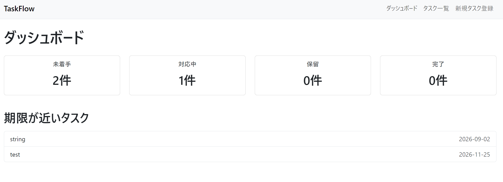
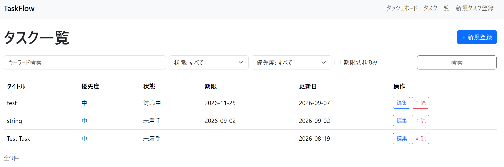
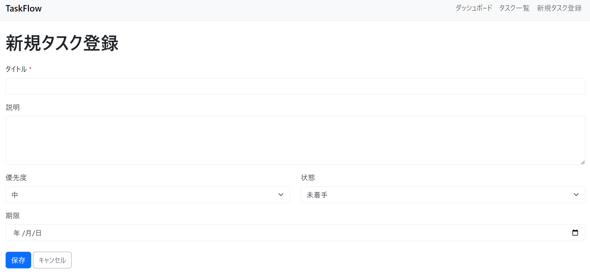

# TaskFlow

個人向けのシンプルなタスク管理Webアプリです。タスクの登録・編集・削除・検索・フィルタ・並び替えができ、ダッシュボードで状況を一目で確認できます。

## 概要

- タスクの登録・一覧・編集・削除（CRUD）
- タイトルによるキーワード検索
- 状態・優先度・期限切れによる絞り込み
- 登録日・期限・優先度による並び替え
- 状態別の件数と期限が近いタスクを表示するダッシュボード
- PCではテーブル表示、スマートフォンではカード表示に自動で切り替わるレスポンシブデザイン

## スクリーンショット

### ダッシュボード



### タスク一覧



### タスク登録・編集



## 技術スタック

| 項目 | 採用技術 |
| --- | --- |
| 言語 | Python 3.13以上 |
| フレームワーク | FastAPI |
| ORM | SQLAlchemy 2.x |
| DB | SQLite（開発環境） |
| マイグレーション | Alembic |
| フロントエンド | Jinja2 + Bootstrap 5 |
| テスト | pytest |
| 品質管理 | Ruff / Black |
| CI | GitHub Actions |

## ディレクトリ構成

app/routes/ が HTTP入出力と依存注入、app/services/ が業務ロジック・例外変換、app/repositories/ がDBアクセス、app/models/ がSQLAlchemyモデル、app/schemas/ がPydanticスキーマ、app/templates/ がJinja2テンプレート、app/static/ が静的ファイル(CSS/JS)を扱います。tests/ にpytestテスト、alembic/ にDBマイグレーション、docs/ にドキュメント・スクリーンショットを配置しています。

## セットアップ・起動手順

### 1. リポジトリを取得する

```bash
git clone https://github.com/connectcrew-ishii/taskflow.git
cd taskflow
```

### 2. 仮想環境を作成して有効化する

```bash
python -m venv .venv
```

Windows(Git Bash)の場合:

```bash
source .venv/Scripts/activate
```

Mac/Linuxの場合:

```bash
source .venv/bin/activate
```

### 3. 依存関係をインストールする

```bash
pip install -e ".[dev]"
```

### 4. データベースのマイグレーションを適用する

```bash
alembic upgrade head
```

### 5. アプリケーションを起動する

```bash
uvicorn app.main:app --reload
```

起動後、ブラウザで以下のURLを開いてください。
http://127.0.0.1:8000/


## APIドキュメント

FastAPIの自動生成ドキュメントで、REST API仕様を確認できます。

- Swagger UI: http://127.0.0.1:8000/docs
- ReDoc: http://127.0.0.1:8000/redoc

## テストの実行方法

```bash
pytest tests/ -v
```

## コード品質チェック

```bash
ruff check .
black --check .
```

## ライセンス

準備中（Issue #38で追加予定）。